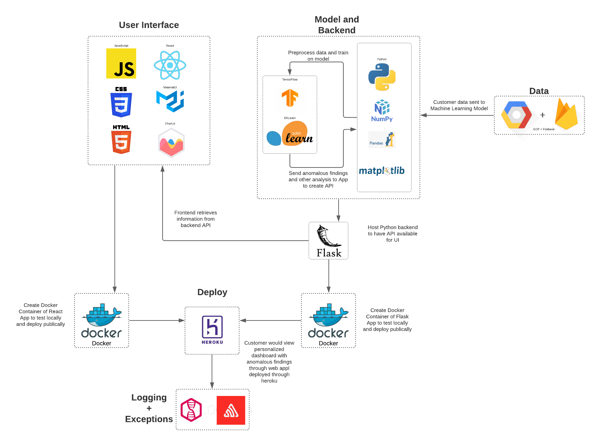

# CUSTOS


[](https://codeclimate.com/repos/5f6d4b5bb5607a511c00428c/test_coverage)
[](https://codeclimate.com/repos/5f6d4b5bb5607a511c00428c/maintainability)


Custos (meaning 'guard' in Latin) is a company founded in the cybersecurity industry. Custos aims to prevent dataloss within your company allowing you to operate with ease of mind.

Table of Contents
---

- [People](./team/)
- [Diversity](./team/diversity.md)
- [Product & Research](./product_research/)
    - [User Research](./product_research/user-research.md)
    - [Roadmap](./product_research/roadmap.md)
- [Getting Started](#getting-started)
    - [Requirements](#requirements)
    - [Installation](#installation)
    - [Run](#run)
    - [Testing](#testing)
- [Architecture Diagram](#architecture-diagram)
- [Accessibility](#accessibility)


## Getting Started

[View web application demo here](https://custos-client.herokuapp.com/)

### Requirements
To run this app locally, you will need:

* Docker

To develop this app, you will need:
* JavaScript (React)
* Python (Flask)

For testing:
* NPM and Jest
* PyTest

### Installation

To install application for development, clone repository using

```
git clone https://github.com/dcsil/Custos.git
```

### Run 

To run the app locally:
```
sudo bash script/bootstrap
```

To run either client or server individually:
```
cd client && sudo bash run_docker.sh
```
```
cd server && sudo bash run_docker.sh
```

### Testing

To run all tests:
```
sudo bash script/run_all_tests
```

 To test client:
 ```
 cd client && npm test
 ```

 To test server:

 ```
 cd server && pytest
 ```


## Architecture Diagram



## Accessibility
Guideline | Summary | Description of how you accommodated this
--- | --- | ---
1.1.1 – Non-text Content | Provide text alternatives for non-text content | Charts and Buttons have labels to allow screen readers to read content
1.2.1 – Audio-only and Video-only (Pre-recorded) | Provide an alternative to video-only and audio-only content | No Audio/Video Content
1.2.2 – Captions (Pre-recorded) | Provide captions for videos with audio | No Video Content
1.2.3 – Audio Description or Media Alternative (Pre-recorded) | Video with audio has a second alternative | No Audio Content
1.3.1 – Info and Relationships | Logical structure | Every Component has descriptive headers identifying the logical structure
1.3.2 – Meaningful Sequence | Present content in a meaningful order | Workflow has an intuitive sequence
1.3.3 – Sensory Characteristics | Use more than one sense for instructions | No Audio instructions
1.4.1 – Use of Colour | Don’t use presentation that relies solely on colour | Colour only used where needed; Provides clear contrast that takes users with colour deficiencies into account (i.e. red and green are not displayed together e.t.c)
1.4.2 – Audio Control | Don’t play audio automatically | No Audio
2.1.1 – Keyboard | Accessible by keyboard only | All features accessible by keyboard only using TAB and Arrow Keys
2.1.2 – No Keyboard Trap | Don’t trap keyboard users | No keyboard traps found
2.2.1 – Timing Adjustable | Time limits have user controls | No time limit features
2.2.2 – Pause, Stop, Hide | Provide user controls for moving content | No auto movement
2.3.1 – Three Flashes or Below | No content flashes more than three times per second | No flashing content
2.4.1 – Bypass Blocks | Provide a ‘Skip to Content’ link | No blocks to skip
2.4.2 – Page Titled | Use helpful and clear page titles | All pages are appropriately titled
2.4.3 – Focus Order | Logical order | No focus needs to be set in order to navigate to particular sequence
2.4.4 – Link Purpose (In Context) | Every link’s purpose is clear from its context | Every link is labelled and has a clear focus
3.1.1 – Language of Page | Page has a language assigned | Language set to `en`
3.2.1 – On Focus | Elements do not change when they receive focus | Focus only on login and signup and elements do not change
3.2.2 – On Input | Elements do not change when they receive input | Input only on login and signup and elements do not change
3.3.1 – Error Identification | Clearly identify input errors | Errors identified with alerts, tested on login and signup
3.3.2 – Labels or Instructions | Label elements and give instructions | All buttons and links have labels
4.1.1 – Parsing | No major code errors | CI checks for code errors, none currently
4.1.2 – Name, Role, Value | Build all elements for accessibility | All components have names and labels, HTML validated, everything parses correctly, and we're using third party libraries that have a large user base with an active open source community
Colour Part II | [Colours are chosen in a way that won't make things difficult for colour blind users](https://venngage.com/blog/color-blind-friendly-palette/) | Colours chosen to accomadate colour blind users.

## Video Writeup
# Frontend
* Home page contains detailed information on past events.
 * Anomalies can be found by clicking the "Only Anomalies" button above the table
* The red ! brings the analyst to a more informative page on the alert
 * Custos Scores (derived from SHAP values) provide model explainability
 * A positive Custos Score implies the feature made the example more anomalous
 * A negative Custos Score implies the feature made the example less anomalous
* All data is fetched from the firebase.
# Backend
* server/train_model folder contains the code used to train the threat detection model
 * Model is trained on a cluster separately from the website.
 * auth.txt.gz and redteam.txt.gz must be downloaded to this folder.
 * Data is subsampled and preprocessed prior to training the model.
* server/upload_data contains the code used to predict anomalies
 * find_anomalies.py and find_background.py must be run to generate required csv files
 * Host the website locally and send a post request to the proper route.
 * Data from the csv's will then be posted to firebase.
* server/run_explainability contains the code used to generate Custos Scores
 * explainability.py uses the csv's generated from find_anomalies.py and find_background.py to generate Custos Scores for the anomalies
 * data is stored in a csv in server/upload_data and is then uploaded to firebase via the post command
* In the future, we will stream data directly from the client and the data flow will occur as follows:
 * the model picks out anomalies
 * the explainability is run on all anomalies to generate Custos Scores
 * data is sent to the firebase to then be fetched by the frontend
 * All code is set up so that we can quickly and efficiently rotate to this production system
