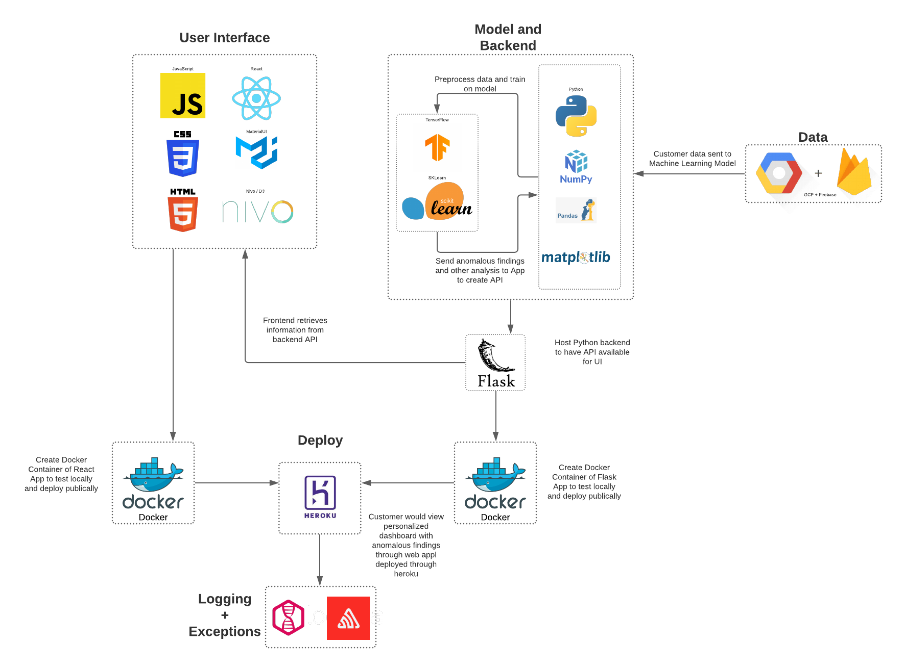

# CUSTOS


Custos (meaning 'guard' in Latin) is a company founded in the cybersecurity industry. Custos aims to prevent dataloss within your company allowing you to operate with ease of mind.

Table of Contents
---

- [People](./team/)
- [Diversity](./team/diversity.md)
- [Product & Research](./product_research/)
    - [Market](./product_research/market.md)
    - [Roadmap](./product_research/roadmap.md)
- [Getting Started](#getting-started)
    - [Requirements](#requirements)
    - [Installation](#installation)
    - [Run](#run)
    - [Testing](#testing)
- [Architecture Diagram](#architecture-diagram)


## Getting Started

### Requirements
To run this app locally, you will need:

* Docker

To develop this app, you will need:
* JavaScript (React)
* Python (Flask)

For testing:
* NPM and Jest
* PyTest

### Installation

To install application for development, clone repository using

```
git clone https://github.com/dcsil/Custos.git
```

### Run 

To run the app locally:
```
sudo bash script/bootstrap
```

To run either client or server individually:
```
cd client && sudo bash run_docker.sh
```
```
cd server && sudo bash run_docker.sh
```

### Testing

To run all tests:
```
sudo bash script/run_all_tests
```

 To test client:
 ```
 cd client && npm test
 ```

 To test server:

 ```
 cd server && pytest
 ```


## Architecture Diagram


